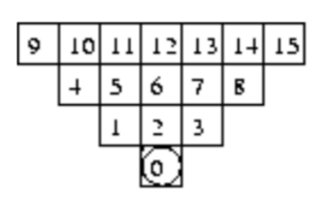
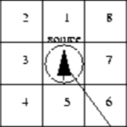

# Zappy - AI Guide

The AI (or Player) is the main actor of the game. Normally not controlled by a human, it is the one that will move around the map, collect resources, and interact with other players. The AI is controlled by a set of commands that are sent to the server. The server will then interpret these commands and apply them to the AI.

There are multiple kinds of information that can be exchanged between the AI and the server either by requesting/sending it or automatically. These components are:

- **Inventory**: The inventory is where the player stores all the resources it has collected. It is not limited in size.
- **Vision**: The vision is the area around the player that it can see. The player can only see what is in its vision. It is represented as a 2D array of cells that form a cone in front of the player.
The number of cells in the vision is determined by the level of the player.
- **Level**: The level of the player determines the size of its vision. When a certain amount of player reach the maximum level (8), the game ends.
- **Incantation**: The incantation is a ritual that the player can perform to level up. It requires a certain number of resources and players to be present on the same cell.
- **Broadcast**: A message that the player can send to every other player on the map. When received, a player will get the message and direction from which it was sent.

## AI behavior

In order to survive, the player must collect food scattered around the map. Every hunger cycle (126 units of time), the player will lose 1 unit of food. If the player does not have food in its inventory at the end of the hunger cycle, one life unit is deducted from the player. If the player reaches 0 life units, it dies. At the start of the game, the player has 10 life units.

## Commands

The AI can send commands to the server to control its behavior and get information. The commands are:

| Command              | Details                                                      | Duration | Server reponse        |
|----------------------|--------------------------------------------------------------|----------|-----------------------|
| `Forward`            | Move forward one tile                                        | 7/f      | ok                    |
| `Left`               | Turn 90 degres left                                          | 7/f      | ok                    |
| `Right`              | Turn 90 degres right                                         | 7/f      | ok                    |
| `Look`               | Look in front of you                                         | 7/f      | **Vision array**      |
| `Inventory`          | Get your inventory                                           | 1/f      | **Inventory array**   |
| `Broadcast` **text** | Broadcast the message **text**                               | 7/f      | ok                    |
| `Connect_nbr`        | Get the number of available slots for your team              | 0/f      | **number of slots**   |
| `Fork`               | Open a new slot for your team                                | 42/f     | ok                    |
| `Eject`              | eject players and destroy all open slots on the current tile | 7/f      | ok/ko                 |
| `Take` **object**    | Take an object **object** from the current tile              | 7/f      | ok/ko                 |
| `Set` **object**     | Drop an object **object** from your inventory                | 7/f      | ok/ko                 |
| `Incantation`        | Perform an elevation ritual on the current tile              | 300/f    | **Elevation message** |

## Vision array

The vision array is a 2D array of cells that represent the cells in front of the players. The array is formatted as follows:

```
[tile0, tile1, tile2, tile3, ...]
```

Where the number of tiles is determined by the level of the player. At level 1, the player can see the tile it is standing on and the 3 tiles in front of it horizontally (see the diagram below).



With each level increase, the player is able to see further in front by one tile and thwo tiles on the sides, meaning that at level 1 the player can see up to tile 3, at level 2 up to tile 8, at level 3 up to tile 15, and so on.

Each tile contains the entities and items that are present on it. Here is an example of a vision array:

```
[player player player food, linemate deraumere sibur, mendiane, phiras thystame]
```

It shows that there are 2 other players on the tile along with food, and some resources in front of the player.

## Inventory array

The inventory array is a list of resources that the player has collected. It is formatted differently from the vision array and is returned by the *Inventory* command:
    
```
[food 0, linemate 3, deraumere 2, sibur 1, mendiane 0, phiras 0, thystame 0]
```

This example shows that the player has collected 3 linemate, 2 deraumere, and 1 sibur.

## Broadcast message

When the player receives a broadcast message, it will be in the following format:

```
message **dir** **text**
```

Where **dir** is the direction from which the message was sent and **text** is the message itself.
the direction



The direction number is relative to the player's orientation. Meaning that 1 is always the direction in front of the player.

## Elevation message

The elevation message is a message that is returned by the server when the player performs an incantation. It can be one of the following:

- **Elevation underway**: The incantation is in progress and the player must wait for it to finish.
- **[Current level]**: The incantation was a success and the player is now at the specified level.
- **ko**: The incantation failed and the player remains at the same level.

## Elevation Requirements

To perform an elevation, the player must be on a tile with the required resources and players. The resources required are determined by the level of the player and are as follows:

| Target Level | Players | Linemate | Deraumere | Sibur | Mendiane | Phiras | Thystame |
|--------------|---------|----------|-----------|-------|----------|--------|----------|
| 2            | 1       | 1        | 0         | 0     | 0        | 0      | 0        |
| 3            | 2       | 1        | 1         | 1     | 0        | 0      | 0        |
| 4            | 2       | 2        | 0         | 1     | 0        | 2      | 0        |
| 5            | 4       | 1        | 1         | 2     | 0        | 1      | 0        |
| 6            | 4       | 1        | 2         | 1     | 3        | 0      | 0        |
| 7            | 6       | 1        | 2         | 3     | 0        | 1      | 0        |
| 8            | 6       | 2        | 2         | 2     | 2        | 2      | 1        |

## Communication

The AI and server communicate using a TCP connection. Messages text is sent through the socket and terminated by a newline character. 

When connecting to the server, the AI will receive a welcome message. The AI will then have to send its team name to the server, which will then add the player to the game and respond with the map size and the number of open slots left for the chosen team.

Example of communication:
```
SERVER: WELCOME
AI:     team_name
SERVER: map_size
SERVER: slots_left
```

---
<- [Back to README](../README.md)